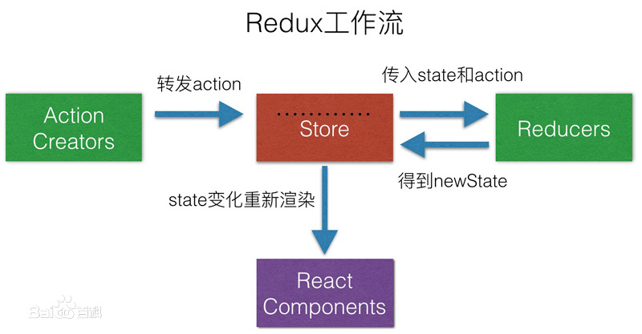

## 分支一览

- `feature/react-redux` mapStateToProps, mapDispatchToProps, bindActionCreators
- `feature/redux-thunk` redux-thunk
- `feature/redux-actions` redux-thunk, redux-actions
- `feature/redux-saga` redux-saga

## 项目启动

`master` 分支无代码，请先 checkout 到上述分支。

```bash
yarn # 不同分支引入的包不同，需重新执行yarn
yarn start
```

## 技术点总结

概念：Redux 是 JavaScript 状态容器，提供可预测化的状态管理。

Redux 三个基本原则： 单一数据源、 State 只读、 使用纯函数来修改执行。

Action 是把数据从应用传到 store 的有效载荷，它是 store 数据的唯一来源。一般通过 store.dispatch() 将 action 传到 store。

Reducers 指定了应用状态的变化如何响应 actions 并发送到 store 的，记住 actions 只是描述了有事情发生了这一事实，并没有描述应用如何更新 state。

Store 就是把 Action、Reducers 联系到一起的对象。Store 有以下职责：

- 维持应用的 state；
- 提供 getState() 方法获取 state；
- 提供 dispatch(action) 方法更新 state；
- 通过 subscribe(listener) 注册监听器；
- 通过 subscribe(listener) 返回的函数注销监听器；

### Redux API

- `createStore(reducer, [preloadedState], enhancer)` 创建一个 Redux store 来以存放应用中所有的 state；
- `applyMiddleware(...middleware)` 应用中间件；
- `combineReducers(reducers)` 是一个辅助函数，把多个 reducer 函数合并成一个最终的 reducer 函数；
- `bindActionCreators(actionCreators, dispatch) ` 使用 dispatch 对每个 action creator 进行包装，以便可以直接调用它们；

### Redux 工作流



### SEE ALSO

- [redux EN](https://redux.js.org/)
